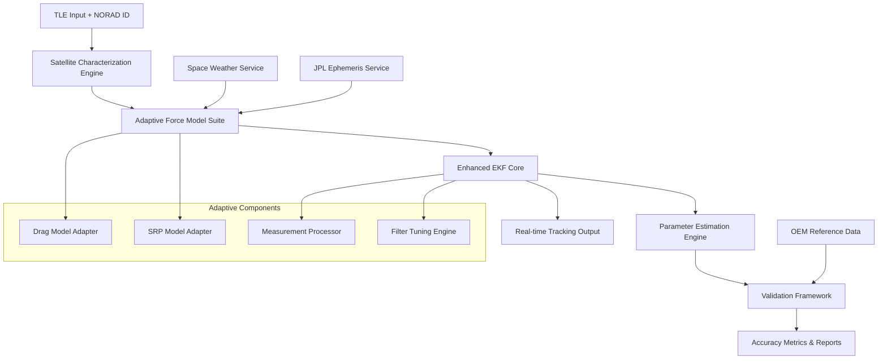

# Design Document

## Overview

The Enhanced Orbital Determination System will be redesigned to achieve sub-1km accuracy across any LEO satellite through a satellite-agnostic architecture. The system builds upon the existing EKF framework but introduces adaptive algorithms, enhanced force modeling, and robust parameter estimation to work universally across different satellite types, orbital regimes, and operational conditions.

The core design philosophy emphasizes generalizability over satellite-specific tuning, ensuring the same algorithms can achieve sub-1km accuracy for ISS, Sentinel, Starlink, or any LEO satellite without manual reconfiguration.

## Architecture

### High-Level System Architecture



### Core Components Architecture

The system consists of several interconnected components designed for modularity and satellite-agnostic operation:

1. **Satellite Characterization Engine**: Automatically determines satellite properties from TLE behavior
2. **Adaptive Force Model Suite**: Adjusts force modeling based on orbital regime and satellite characteristics
3. **Enhanced EKF Core**: Improved Kalman filter with adaptive noise tuning and robust numerics
4. **Parameter Estimation Engine**: Real-time estimation of ballistic coefficient, SRP parameters, and empirical accelerations
5. **Validation Framework**: Universal validation against any available OEM reference data

## Components and Interfaces

### 1. Satellite Characterization Engine

**Purpose**: Automatically characterize satellite properties from TLE data and orbital behavior.

**Key Interfaces**:
- Input: TLE data, NORAD ID, optional satellite database
- Output: Estimated mass, drag area, SRP area, orbital regime classification

**Design Approach**:
- Analyze TLE decay rates to estimate ballistic coefficient
- Use orbital altitude and inclination to classify satellite type
- Apply machine learning models trained on known satellite parameters
- Maintain uncertainty bounds for unknown parameters

```python
class SatelliteCharacterizer:
    def characterize_satellite(self, tle_data: TLEData, norad_id: str) -> SatelliteProperties:
        # Estimate ballistic coefficient from TLE decay analysis
        # Classify orbital regime (LEO altitude bands)
        # Apply ML models for mass/area estimation
        # Return characterized satellite with uncertainty bounds
```

### 2. Adaptive Force Model Suite

**Purpose**: Provide satellite-agnostic force modeling that adapts to different orbital regimes and satellite characteristics.

**Key Interfaces**:
- Input: Satellite properties, orbital state, space weather data
- Output: Perturbation accelerations with appropriate scaling

**Enhanced Force Models**:

#### Atmospheric Drag Adapter
- **Altitude-dependent density models**: NRLMSISE-00 with automatic altitude regime detection
- **Shape factor estimation**: Adaptive drag coefficient based on satellite type classification
- **Space weather integration**: Real-time F10.7 and Kp data for density corrections
- **Uncertainty propagation**: Drag parameter uncertainty based on characterization confidence

#### Solar Radiation Pressure Adapter  
- **Area-to-mass ratio estimation**: Adaptive SRP coefficient based on satellite classification
- **Enhanced eclipse modeling**: Precise umbra/penumbra calculations using JPL ephemeris
- **Attitude-independent modeling**: Conservative SRP estimates for unknown attitude profiles
- **Seasonal variations**: Account for Earth-Sun distance variations

#### Enhanced Geopotential Model
- **Altitude-adaptive harmonics**: Use higher-order terms for lower altitudes, reduced terms for higher altitudes
- **Computational optimization**: Automatic selection of harmonic degree based on accuracy requirements
- **Regional variations**: Enhanced coefficients for specific geographic regions if needed

### 3. Enhanced EKF Core

**Purpose**: Robust Extended Kalman Filter with adaptive tuning and numerical stability enhancements.

**Key Enhancements**:

#### Adaptive State Vector
- **Dynamic dimensionality**: Adjust state vector size based on satellite characteristics
- **Parameter inclusion**: Automatically include/exclude parameters based on observability
- **Uncertainty management**: Proper initialization of covariance for unknown parameters

#### Robust Numerics
- **Joseph form covariance update**: Ensure positive definiteness
- **Square-root filtering**: Improved numerical stability for ill-conditioned problems
- **Adaptive regularization**: Prevent covariance collapse through intelligent regularization

#### Innovation-Based Adaptation
- **Process noise tuning**: Real-time Q matrix adaptation based on innovation statistics
- **Measurement noise tuning**: R matrix adaptation based on TLE age and quality metrics
- **Divergence detection**: Multi-level divergence detection with graceful recovery

```python
class EnhancedEKF:
    def __init__(self, satellite_props: SatelliteProperties):
        self.state_dim = self._determine_state_dimension(satellite_props)
        self.adaptive_tuner = AdaptiveFilterTuner()
        self.numerics_stabilizer = NumericsStabilizer()
    
    def predict_and_update(self, dt: float, measurement: Optional[Measurement]) -> TrackingResult:
        # Adaptive prediction with satellite-specific force models
        # Robust measurement update with innovation-based tuning
        # Numerical stabilization and divergence detection
```

### 4. Parameter Estimation Engine

**Purpose**: Real-time estimation of satellite-specific parameters using sliding-window batch processing.

**Key Features**:

#### Multi-Parameter Estimation
- **Ballistic coefficient (Bc)**: Drag-related parameter estimation
- **SRP coefficient (Cr)**: Solar radiation pressure parameter estimation  
- **Empirical accelerations**: Along-track, cross-track, and radial empirical terms
- **Correlation handling**: Proper treatment of parameter correlations

#### Robust Optimization
- **Levenberg-Marquardt algorithm**: Robust nonlinear least squares
- **Constraint handling**: Physical bounds on all parameters
- **Outlier rejection**: Robust estimation techniques for measurement outliers
- **Convergence monitoring**: Automatic detection of parameter convergence

#### Adaptive Window Management
- **Dynamic window sizing**: Adjust estimation window based on data quality and parameter stability
- **Overlap optimization**: Optimal window overlap for smooth parameter evolution
- **Quality metrics**: Parameter estimation quality assessment and uncertainty quantification

### 5. Measurement Processing System

**Purpose**: Intelligent processing of TLE-derived measurements with bias mitigation and quality assessment.

**Key Features**:

#### TLE Quality Assessment
- **Age-dependent weighting**: Reduce measurement weight as TLE ages
- **SGP4 bias detection**: Identify and mitigate systematic SGP4 biases
- **Innovation monitoring**: Use innovation statistics to assess measurement quality
- **Adaptive scheduling**: Intelligent scheduling of TLE updates based on filter confidence

#### Multi-Source Integration
- **TLE prioritization**: Prefer fresher TLE data from multiple sources
- **Cross-validation**: Compare TLE sources for consistency checking
- **Quality flagging**: Flag and handle poor-quality TLE data appropriately

### 6. Universal Validation Framework

**Purpose**: Satellite-agnostic validation against any available OEM reference data.

**Key Features**:

#### Flexible Reference Data Handling
- **Multi-format support**: Handle NASA OEM, ESA, commercial ephemeris formats
- **Automatic format detection**: Detect and parse different ephemeris formats
- **Timestamp synchronization**: Precise timestamp matching for validation
- **Interpolation management**: Handle sparse reference data through intelligent interpolation

#### Comprehensive Metrics
- **Universal accuracy metrics**: RMS, P95, percentage statistics for any satellite
- **Orbital regime analysis**: Accuracy assessment by altitude, inclination, eccentricity
- **Time-series analysis**: Error evolution and trend analysis
- **Comparative analysis**: Performance comparison across different satellites

## Data Models

### Core Data Structures

#### SatelliteProperties
```python
@dataclass
class SatelliteProperties:
    norad_id: str
    mass: float  # kg
    drag_area: float  # m²
    srp_area: float  # m²
    drag_coefficient: float
    srp_coefficient: float
    orbital_regime: OrbitalRegime
    uncertainty_bounds: Dict[str, Tuple[float, float]]
    characterization_confidence: float
```

#### AdaptiveFilterConfig
```python
@dataclass  
class AdaptiveFilterConfig:
    process_noise_base: np.ndarray
    measurement_noise_base: np.ndarray
    adaptation_rates: Dict[str, float]
    stability_thresholds: Dict[str, float]
    divergence_thresholds: Dict[str, float]
```

#### ValidationResult
```python
@dataclass
class ValidationResult:
    satellite_id: str
    validation_period: Tuple[datetime, datetime]
    metrics: AccuracyMetrics
    error_time_series: List[float]
    recommendations: List[str]
    performance_grade: str
```

## Error Handling

### Robust Error Management Strategy

#### Graceful Degradation
- **Force model fallbacks**: Simplified models when enhanced models fail
- **Parameter estimation fallbacks**: Default parameters when estimation fails
- **Measurement processing fallbacks**: Conservative processing when quality assessment fails

#### Error Recovery Mechanisms
- **Filter reinitialization**: Intelligent filter restart with preserved parameter estimates
- **Parameter reset**: Reset unstable parameters to physically reasonable defaults
- **Quality degradation alerts**: Notify operators when accuracy may be compromised

#### Logging and Diagnostics
- **Comprehensive logging**: Detailed logging of all error conditions and recovery actions
- **Performance monitoring**: Real-time monitoring of filter health and accuracy metrics
- **Diagnostic outputs**: Detailed diagnostic information for troubleshooting

## Testing Strategy

### Multi-Level Testing Approach

#### Unit Testing
- **Component isolation**: Test each component independently with mock inputs
- **Algorithm validation**: Verify mathematical correctness of all algorithms
- **Edge case handling**: Test boundary conditions and error scenarios

#### Integration Testing
- **End-to-end workflows**: Test complete tracking workflows for different satellite types
- **Cross-component interaction**: Verify proper interaction between adaptive components
- **Performance testing**: Ensure real-time performance requirements are met

#### Validation Testing
- **Historical data validation**: Test against historical OEM data for multiple satellites
- **Cross-satellite validation**: Verify consistent performance across different satellite types
- **Accuracy regression testing**: Ensure accuracy improvements don't introduce regressions

#### Operational Testing
- **Real-time testing**: Test with live TLE and space weather data
- **Extended duration testing**: Multi-day tracking tests to verify stability
- **Stress testing**: Test system behavior under high-load and degraded data conditions

### Test Data Strategy

#### Synthetic Test Cases
- **Controlled scenarios**: Generate synthetic data with known truth for algorithm verification
- **Error injection**: Test robustness by injecting various error conditions
- **Parameter sweeps**: Test performance across wide parameter ranges

#### Historical Validation Datasets
- **Multi-satellite datasets**: Collect OEM data for ISS, Sentinel, Starlink, and other LEO satellites
- **Multi-temporal datasets**: Data spanning different space weather conditions and orbital configurations
- **Quality-varied datasets**: Include both high-quality and degraded TLE data for robustness testing

## Performance Considerations

### Computational Optimization

#### Real-Time Performance
- **Algorithmic efficiency**: Optimize force model computations for real-time operation
- **Memory management**: Efficient management of historical data and state buffers
- **Parallel processing**: Utilize multi-threading for independent satellite tracking

#### Scalability Design
- **Satellite-independent processing**: Design for concurrent tracking of multiple satellites
- **Resource allocation**: Dynamic resource allocation based on accuracy requirements
- **Load balancing**: Distribute computational load across available resources

### Accuracy vs Performance Trade-offs
- **Adaptive fidelity**: Adjust force model fidelity based on accuracy requirements and computational constraints
- **Quality-based processing**: Reduce processing for low-quality data to preserve resources for high-quality tracking
- **Predictive resource management**: Anticipate computational needs based on orbital dynamics and data quality